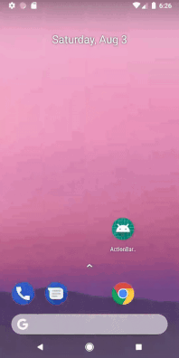

# Display Menu Icon & Popup Menu.



## Introduction

The purpose of this app is to show how to display icon in action bar using menu resource xml file and how to display popup menu.

### Note: 

In these projects we have inflate menu items using xml & java file :

* [ActionBar_OptionMenu_Xml_Android_Github.](https://github.com/amansharma-dev/ActionBar_OptionMenu_Xml_Android_Github/ "ActionBar_OptionMenu_Xml_Android_Github.")
* [ActionBar_OptionMenu_Java_RunTime_Android_Github.](https://github.com/amansharma-dev/ActionBar_OptionMenu_Java_RunTime_Android_Github/ "ActionBar_OptionMenu_Java_RunTime_Android_Github.")

## Display Icon

Right Click on res directory

> New
>> Android Resource File

Make sure you select Resource type as Menu.

We name it **menu_main.xml**.

In **menu_main.xml** :

```
<item
        android:id="@+id/action_menu"
        android:title="@string/menu"
        app:showAsAction="always"
        android:icon="@drawable/ic_direction"
        />
```

Make sure you add this line of code `android:icon="@drawable/ic_direction"` & `app:showAsAction="always"` to add a icon on action bar menu.

#### Now Take Refrence from this project and follow the steps [ActionBar_OptionMenu_Xml_Android_Github.](https://github.com/amansharma-dev/ActionBar_OptionMenu_Xml_Android_Github/ "ActionBar_OptionMenu_Xml_Android_Github.")

## Display Popup Menu on onClick Button

Right Click on res directory

> New
>> Android Resource File

Make sure you select Resource type as Menu.

We name it **popup_menu.xml**.

In **popup_menu.xml** :

```
<item
        android:id="@+id/action_menuOne"
        android:title="@string/menu_one"
        android:orderInCategory="101"
        />

    <item
        android:id="@+id/action_menuTwo"
        android:title="@string/menu_two"
        android:orderInCategory="102"
        />

    <item
        android:id="@+id/action_menuThree"
        android:title="@string/menu_three"
        android:orderInCategory="103"
        />

```

Now in **MainActivity** add a onClickListener on Button, i have done it in **main_activity.xml** by adding this line of code `android:onClick="popupMenuButton"` to a Button

To display Popup Menu on onClick of a Button add this piece of code inside `public void popupMenuButton(View view){ }`

```
PopupMenu popupMenu = new PopupMenu(this,view);
        popupMenu.getMenuInflater().inflate(R.menu.popup_menu,popupMenu.getMenu());

        popupMenu.setOnMenuItemClickListener(new PopupMenu.OnMenuItemClickListener() {
            @Override
            public boolean onMenuItemClick(MenuItem item) {
                int id = item.getItemId();
                switch (id){
                    case R.id.action_menuOne:
                        Toast.makeText(getApplicationContext(), "Menu 1 Clicked", Toast.LENGTH_SHORT).show();
                        break;

                    case R.id.action_menuTwo:
                        Toast.makeText(getApplicationContext(), "Menu 2 Clicked", Toast.LENGTH_SHORT).show();
                        break;

                    case R.id.action_menuThree:
                        Toast.makeText(getApplicationContext(), "Menu 3 Clicked", Toast.LENGTH_SHORT).show();
                        break;
                        
                        }

                return false;
            }
        });
        
        popupMenu.show();
                        
```

# Thank you.
